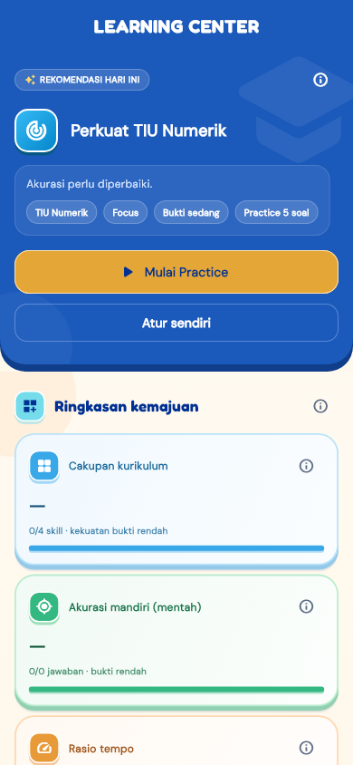
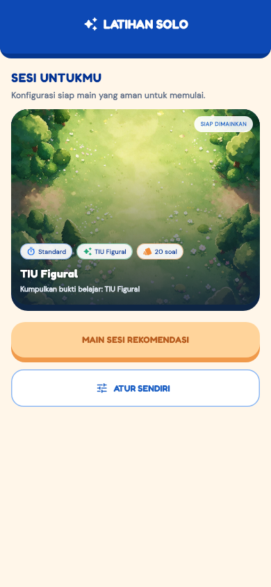
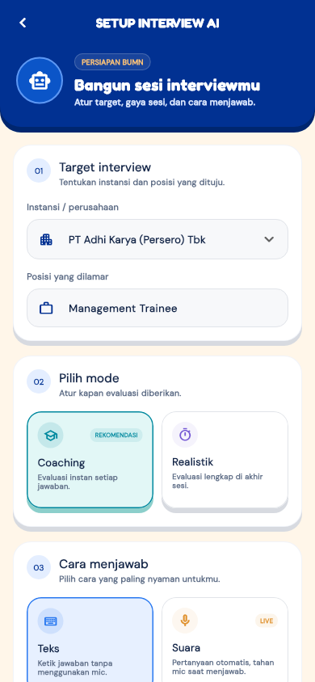
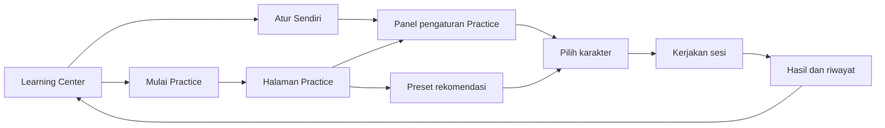
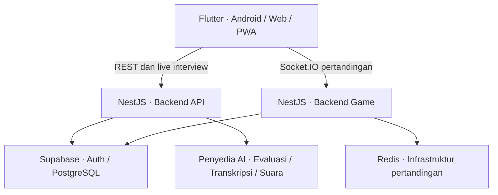

<p align="center">
  
</p>

<h1 align="center">YUDHA</h1>

<p align="center">
  <strong>Your Ultimate Digital Hiring Arena</strong><br />
  Belajar terarah. Bertanding dengan pengetahuan. Berlatih menghadapi interview.<br />
  Persiapan CPNS dan BUMN dalam satu arena digital.
</p>

<p align="center">
  
  
  
  
</p>

<p align="center">
  <a href="#lihat-yudha">Screenshot</a> ·
  <a href="#peta-fitur">Peta fitur</a> ·
  <a href="#arsitektur">Arsitektur</a> ·
  <a href="#menjalankan-proyek">Mulai development</a> ·
  <a href="#dokumentasi">Dokumentasi</a>
</p>

## Tentang YUDHA

YUDHA menggabungkan persiapan seleksi kerja dengan pengalaman bermain. Pengguna dapat melihat perkembangan belajar, berlatih sesuai rekomendasi atau memilih materi sendiri, menguji pengetahuan dalam pertandingan, serta melatih jawaban interview.

Aplikasi dibangun dengan Flutter untuk Android dan web/PWA. Repository ini mencakup aplikasi pengguna, API utama, layanan pertandingan realtime, kontrak data, dan migrasi database. Ketersediaan fitur AI dan layanan realtime bergantung pada konfigurasi backend.

## Lihat YUDHA

Dari menentukan fokus belajar sampai menyiapkan interview—berikut tampilan halaman YUDHA.

<table>
  <tr>
    <th align="center">Learning Center</th>
    <th align="center">Practice / Solo</th>
    <th align="center">Interview AI</th>
  </tr>
  <tr>
    <td align="center"><a href="assets/readme/learning.png"></a></td>
    <td align="center"><a href="assets/readme/practice.png"></a></td>
    <td align="center"><a href="assets/readme/interview.png"></a></td>
  </tr>
  <tr>
    <td align="center">Tentukan langkah belajar berikutnya.</td>
    <td align="center">Pakai rekomendasi atau atur sesi sendiri.</td>
    <td align="center">Siapkan latihan sesuai posisi tujuan.</td>
  </tr>
</table>

<sub>Screenshot dirender dari halaman Flutter asli dengan data contoh pengujian widget, bukan data akun pengguna atau bukti hasil production. Klik gambar untuk melihat ukuran penuh.</sub>

### Satu aplikasi, tiga cara berkembang

| Belajar terarah | Uji pemahaman | Latih komunikasi |
|---|---|---|
| Learning Center membantu membaca bukti belajar dan memilih fokus latihan. | Practice memberi ruang latihan mandiri; PvP menghadirkan pertandingan kuis realtime. | Interview AI menyediakan simulasi pertanyaan dan evaluasi jawaban sesuai target posisi. |

## Peta fitur

| Area | Kemampuan | Manfaat untuk pengguna |
|---|---|---|
| **Learning Center** | Ringkasan kemajuan, bukti belajar per skill, tren, dan rekomendasi latihan | Menentukan materi yang perlu dilatih berikutnya |
| **Practice / Solo** | Cara latihan Standard, Focus, dan Speed; pilihan jumlah soal; materi seimbang, rekomendasi, atau topik sendiri | Menyesuaikan sesi dengan kebutuhan belajar |
| **Arena PvP** | Pertandingan kuis realtime dengan karakter dan mekanik serangan | Menguji pemahaman dalam kompetisi |
| **Interview AI** | Pilihan perusahaan dan posisi, mode coaching atau realistic, jawaban teks dan suara, evaluasi, serta riwayat sesi | Melatih penyampaian jawaban dan meninjau hasil latihan |
| **Lobby & progres** | Akses cepat, quest harian, dan progres pemain | Menjaga rutinitas belajar |
| **Leaderboard** | Peringkat dan posisi pemain | Memantau perkembangan kompetitif |
| **Profil & personalisasi** | Target persiapan, karakter, dan item kosmetik | Menyesuaikan pengalaman bermain |

### Alur belajar



Rekomendasi menjadi titik awal yang tetap bisa diubah. Mengganti cara latihan atau jumlah soal dari preset mengalihkan materi ke pilihan topik. Memilih **Rekomendasi** kembali memulihkan preset tersebut.

## Arsitektur



| Komponen | Teknologi dan tanggung jawab |
|---|---|
| Aplikasi | Flutter, Riverpod, GoRouter; antarmuka, state, navigasi, dan klien jaringan |
| Backend API | NestJS dan TypeScript; profil, konten, learning, latihan, interview, dan progres |
| Backend Game | NestJS dan Socket.IO; koneksi pertandingan dan state permainan |
| Data dan autentikasi | Supabase |
| AI interview | Penyedia evaluasi, transkripsi, dan sintesis suara sesuai konfigurasi environment |

### Struktur repository

```text
apps/
  mobile/          Aplikasi Flutter dan PWA
  backend-api/     API utama dan layanan interview
  backend-game/    Layanan pertandingan realtime
  games/data/      Sumber data soal
contracts/         Kontrak API, socket, dan schema bersama
infra/             Infrastruktur dan migrasi Supabase
docs/              Panduan, spesifikasi produk, desain, dan devlog
```

## Menjalankan proyek

### Prasyarat

- Node.js 20 atau lebih baru dan npm.
- Flutter SDK dengan Dart yang sesuai dengan batasan di [pubspec.yaml](apps/mobile/pubspec.yaml).
- Project Supabase yang sudah disiapkan sesuai [panduan database](infra/supabase/README.md).
- Redis jika diperlukan oleh konfigurasi backend pertandingan.

### 1. Backend API

Jalankan dari root repository menggunakan PowerShell:

```powershell
Set-Location apps/backend-api
Copy-Item .env.example .env
npm ci
npm run start:dev
```

Isi konfigurasi Supabase pada `.env` sebelum menjalankan service. Port default API adalah `3000`. Lihat [.env.example API](apps/backend-api/.env.example) untuk pilihan penyedia AI dan parameter interview.

Untuk suara live, aktifkan `INTERVIEW_LIVE_SPEECH_ENABLED=true` dan lengkapi konfigurasi transkripsi serta sintesis suara. Kunci layanan AI dan service-role Supabase hanya digunakan di backend.

### 2. Backend pertandingan

Buka terminal baru dari root repository:

```powershell
Set-Location apps/backend-game
Copy-Item .env.example .env
npm ci
npm run start:dev
```

Atur `PORT=3001` agar tidak berbenturan dengan API, lalu lengkapi konfigurasi Supabase dan Redis sesuai [.env.example Game](apps/backend-game/.env.example).

### 3. Aplikasi Flutter

Buat `apps/mobile/.env` dengan nilai untuk lingkungan yang digunakan:

```dotenv
SUPABASE_URL=https://your-project.supabase.co
SUPABASE_PUBLISHABLE_KEY=your-publishable-key
YUDHA_API_BASE_URL=http://10.0.2.2:3000
YUDHA_GAME_BASE_URL=http://10.0.2.2:3001
FIREBASE_WEB_VAPID_KEY=
```

Alamat `10.0.2.2` digunakan oleh emulator Android untuk mengakses komputer host. Untuk HP fisik, gunakan alamat LAN komputer yang dapat dijangkau HP. Untuk browser lokal, gunakan `localhost`; deployment web menggunakan HTTPS.

```powershell
Set-Location apps/mobile
flutter pub get
flutter run --dart-define-from-file=.env
```

Untuk menjalankan versi web:

```powershell
flutter run -d chrome --dart-define-from-file=.env
```

Konfigurasi aplikasi dibaca saat build. Jalankan ulang atau build ulang setelah mengganti nilai environment. Panduan PWA dan deployment tersedia di [README Mobile](apps/mobile/README.md).

## Pemeriksaan kualitas

Jalankan pada direktori service backend yang ingin diperiksa:

```powershell
npm run build
npm test
npm run lint
```

Perintah lint backend juga menerapkan perbaikan otomatis. Untuk aplikasi, jalankan dari `apps/mobile`:

```powershell
flutter analyze
flutter test
```

## Dokumentasi

| Panduan | Isi |
|---|---|
| [Repository Master Guide](docs/MASTER.md) | Pintu masuk dokumentasi dan alur development |
| [Spesifikasi produk](docs/PRD.md) | Scope, model data, dan keputusan produk |
| [Mobile & PWA](apps/mobile/README.md) | Environment aplikasi dan deployment web |
| [Backend API](apps/backend-api/README.md) | Pengembangan API utama |
| [Backend Game](apps/backend-game/README.md) | Pengembangan layanan pertandingan |
| [Kontrak bersama](contracts/README.md) | Acuan integrasi antarservice |
| [Kontrak Solo](contracts/solo/README.md) | Konfigurasi dan perilaku sesi Solo |
| [Kontrak Interview AI](contracts/interview-ai/README.md) | Integrasi interview |
| [Database Supabase](infra/supabase/README.md) | Setup dan operasi database |

## Identitas visual

Logo README menggunakan aset yang sama dengan ikon aplikasi dan halaman login: [app-icon-new.png](apps/mobile/assets/branding/app-icon-new.png).

- [Branding](apps/mobile/assets/branding/) — ikon aplikasi dan splash.
- [Navigasi](apps/mobile/assets/icons/navigation/) — ikon menu.
- [Aset game](apps/mobile/assets/game/) — karakter, arena, kartu, dan elemen pertandingan.

## Lisensi

Repository ini belum menetapkan lisensi open-source publik. Package backend ditandai `UNLICENSED`.
