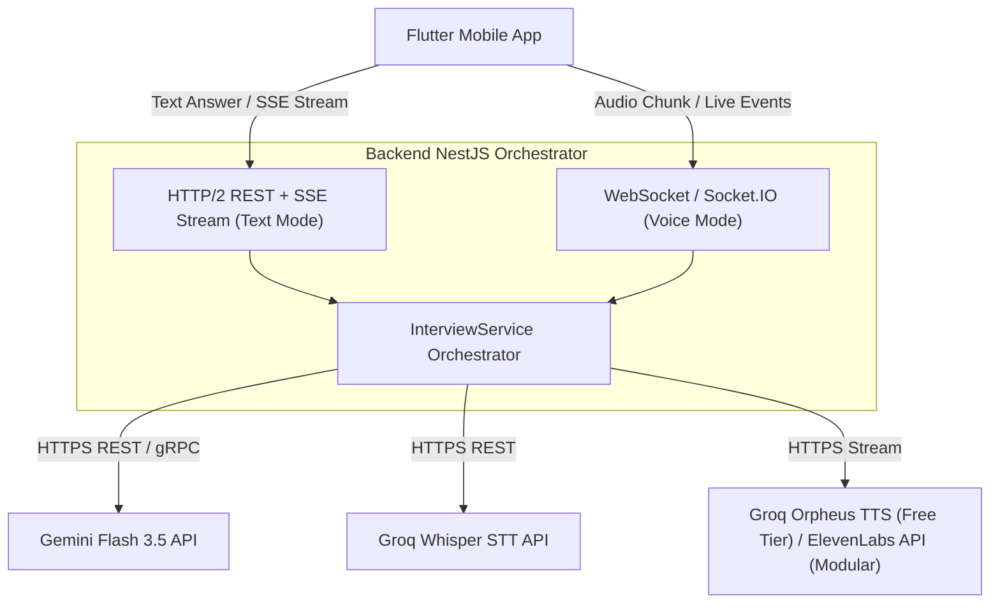
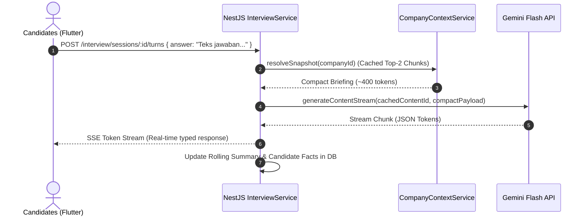
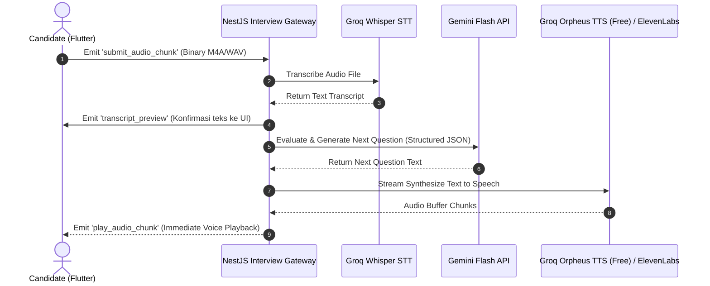

# YUDHA — AI Mock Interview Engine (PRD & Technical Specification)

> **Document Status:** Living Document / Technical Spec  
> **Target Module:** `apps/backend-api/src/interview`  
> **Parent Document:** [`docs/PRD.md`](file:///Users/tri/Documents/code/yudha-app/docs/PRD.md)  
> **Last Updated:** 2026-07-21  

---

## 1. Executive Summary & Vision

Modul **AI Mock Interview** di YUDHA adalah mesin wawancara cerdas berbasis persona interviewer yang mensimulasikan proses seleksi kerja (CPNS & BUMN). Modul ini menawarkan:
1. **High Reasoning & Precise Evaluation**: Menggunakan **Gemini Flash 3.5 / 2.5** untuk analisa jawaban kandidat berakurasi tinggi (penilaian STAR framework & core values AKHLAK/CPNS).
2. **Ultra-Low Token Footprint (75%–85% Token Reduction)**: Memanfaatkan *Anthropic Contextual Retrieval*, *Gemini Context Caching*, dan *Rolling State Compression*.
3. **Dual Mode Execution**: Mode **Text-to-Text (T2T)** untuk pemodelan cepat dan mode **Speech-to-Speech (S2S)** dengan STT Groq Whisper (`whisper-large-v3-turbo`) dan TTS engine **Groq Orpheus** (`canopylabs/orpheus-v1-english`) pada Free Tier, serta arsitektur modular yang dapat dengan mudah di-switch ke **ElevenLabs** di masa depan.
4. **Low-Latency Streaming Protocol**: Menggunakan **HTTP/2 Server-Sent Events (SSE)** untuk Text Streaming dan **WebSocket (Socket.IO)** untuk Voice Streaming, menghindari bottleneck tanpa menambah kompleksitas overhead gRPC pada client mobile.

---

## 2. Token Efficiency & Cost Benchmarks

### 2.1 Perbandingan Penghematan Token (Baseline vs Optimized)

| Metric | Naive RAG & Raw History (Baseline) | YUDHA Optimized Architecture | Impact / Reduction |
|---|---|---|---|
| **Company Context Ingestion** | Full Profile Injection (~3,500–5,000 tokens) | Contextual Chunk Retrieval (Top-2 chunks = ~400 tokens) | **~90% Reduction** |
| **System Prompt & Rubric Cost** | Repeated full prompt sending (~1,200 tokens/turn) | Gemini Context Caching (~75% API discount pointer) | **~75% Cost Reduction** |
| **Conversation Memory** | Accumulative Raw Chat Logs (~2,500 tokens at turn 5+) | Rolling Summary + Candidate Facts JSON (~450 tokens fixed) | **~80% Reduction** |
| **Output Token Budget** | Unconstrained Output Generation (~800–1,200 tokens) | Strict JSON Schema Enforcer (~350 max completion tokens) | **~65% Reduction** |
| **Average Total Input Token / Turn** | **~6,500 – 8,500 tokens** | **~850 – 1,200 tokens** | **75% – 85% Total Token Savings** |

---

## 3. Latency Benchmarks & Protocol Architecture

### 3.1 Latency Budget Breakdown

```
[Client Audio/Text] ──(Network)──> [NestJS Gateway] ──> [Whisper STT / RAG] ──> [Gemini Flash] ──> [TTS Engine] ──> [Client Playback]
```

| Phase | Text-to-Text (T2T) Target | Speech-to-Speech (S2S) Target | Bottleneck & Optimization Strategy |
|---|---|---|---|
| **Client Upload & Network** | ~30 – 50 ms | ~80 – 150 ms (Audio Chunking) | HTTP/2 Multiplexing / Socket.IO binary frame |
| **STT Transcription (Groq)** | N/A | ~200 – 350 ms | `whisper-large-v3-turbo` via Groq Cloud API |
| **RAG & Context Lookup** | ~20 – 40 ms | ~20 – 40 ms | In-memory Redis Cache / Supabase PGVector Top-2 |
| **Gemini Flash LLM TTFT (First Byte)**| ~250 – 450 ms | ~250 – 450 ms | Gemini Context Caching + Stream response |
| **TTS Generation & Synthesize** | N/A | ~250 – 450 ms | Sentence-level Chunked Audio Streaming |
| **Total End-to-End Latency** | **~350 – 550 ms** *(Instant feeling)* | **~1.0 – 1.6 s** *(Human conversational pacing)* | Stream per-token (T2T) / Stream audio chunk (S2S) |

### 3.2 Protocol Decision: gRPC vs REST / SSE vs WebSocket

#### Pertanyaan: Apakah perlu gRPC / RPC?
**Jawaban AI Engineer:** **Tidak disarankan untuk Client Mobile (Flutter) <-> Backend Gateway**.
* **Alasan Latensi**: Bottleneck terbesar (90%+) terjadi pada **LLM Inference (~300-500ms)** dan **TTS Synthesis (~300ms)**, bukan pada protocol transport overhead (REST vs gRPC hanya berbeda ~10–20ms).
* **Alasan Mobile Compatibility**: Flutter mendukung WebSocket dan HTTP/2 SSE secara native dengan sangat stabil. Memakai gRPC pada Mobile membutuhkan Envoy Proxy/gRPC-Web setup yang menambah kompleksitas tanpa memberikan dampak latensi yang signifikan.

#### Protokol Terpilih per Use Case:



1. **Text-to-Text Mode**: **HTTP/2 REST dengan Server-Sent Events (SSE)**.
   * Client menerima token streaming ketikan kata-demi-kata. Latensi yang dirasakan (*perceived latency*) mendekati **0ms**.
2. **Speech-to-Speech Mode**: **WebSocket (Socket.IO)** atau **Binary HTTP Multipart**.
   * Client mengirim rekaman audio -> Server memproses STT -> LLM -> TTS per kalimat (*sentence-level chunking*) -> Client mulai memutar audio begitu chunk kalimat 1 selesai dibuat.

---

## 4. Deep-Dive Token Optimization Architecture

### 4.1 Anthropic Contextual Retrieval (Chunk-Level Context Injection)
Setiap dokumen profil instansi/BUMN dipotong (*chunking*) dan disisipkan deskripsi konteks tingkat tinggi sebelum di-embed ke Supabase Vector:

```
[Original Chunk]
"Fokus utama tahun 2026 adalah digitalisasi rantai pasok logistik bahan bakar..."

[Contextualized Chunk for Vector Embedding]
"Dokumen: Profil Strategis PT Pertamina (Persero) - Divisi Logistik.
Isi: Fokus utama tahun 2026 adalah digitalisasi rantai pasok logistik bahan bakar..."
```
* **Dampak**: Mencegah RAG mengambil chunk yang "salah arah", sehingga kita hanya perlu mengambil **Top-2 chunk paling relevan** (~400 token total) tanpa perlu menginjeksi seluruh profil perusahaan.

### 4.2 Gemini Explicit Context Caching
Menggunakan Native Gemini API (`@google/genai`):
* System Instruction, Rubrik Penilaian STAR, dan Prompt Structure di-cache di server Gemini dengan `ttl = 30 minutes`.
* Server NestJS mengirimkan `cachedContentId` pada setiap turn request.
* **Biaya Token**: Input prompt yang di-cache mendapat **diskon 75%** di tarif Gemini Flash.

### 4.3 Candidate Facts & Rolling Summary Memory Compression
State percakapan tidak disimpan sebagai *raw array of messages* yang terus membengkak, melainkan menggunakan struktur kompresi state:

```json
{
  "candidateFacts": {
    "name": "Budi Pratama",
    "targetRole": "Management Trainee Financial Analyst",
    "education": "S1 Akuntansi Universitas Indonesia",
    "strengthsNoted": ["Financial Modeling", "Excel Advanced"],
    "weaknessNoted": ["Pengalaman kepemimpinan tim masih terbatas"]
  },
  "rollingSummary": "Kandidat telah menjelaskan latar belakang pendidikan akuntansi dan motivasi melamar di Bank Mandiri. Di turn 2, kandidat menceritakan pengalaman magang di KAP.",
  "recentTurns": [
    { "role": "interviewer", "content": "Bagaimana Anda menyelesaikan konflik data keuangan saat magang?" },
    { "role": "candidate", "content": "Saya melakukan rekonsiliasi ulang dengan tim audit..." }
  ]
}
```

---

## 5. System Execution Flow

### 5.1 Mode Text-to-Text (T2T)



### 5.2 Mode Speech-to-Speech (S2S)



---

## 6. Alignment with Codebase (`apps/backend-api/src/interview`)

Struktur arsitektur ini selaras dengan kode canonical NestJS yang ada:

* [`InterviewService`](file:*/interview.service.ts): Mengorkestrasi session state, claim turn idempotency, dan memanggil LLM client.
* [`CompanyContextService`](file:*/services/company-context.service.ts): Mengambil RAG snapshot berbasis priority & max char limit.
* `GeminiLlmService`: Mengimplementasikan `InterviewLlmClient` menggunakan `@google/genai` dengan support **Context Caching** dan **Structured Schema**.
* [`GroqSttService`](file:/*/services/groq-stt.service.ts): Service transkripsi suara kandidat berbasis Whisper Turbo.
* [`GroqTtsService`](file:/*/services/groq-tts.service.ts): Service sintesis suara interviewer berbasis **Groq Orpheus** (`canopylabs/orpheus-v1-english`) untuk Free Tier.
* [`ElevenLabsTtsService`](file:/*/services/elevenlabs-tts.service.ts): Service sintesis suara interviewer modular (ElevenLabs Flash v2.5) sebagai provider alternatif.
* **Modular TTS Switcher**: Menggunakan `INTERVIEW_SPEECH_SYNTHESIS_CLIENT` NestJS provider factory yang dikonfigurasi via `INTERVIEW_TTS_PROVIDER=groq` (default) atau `INTERVIEW_TTS_PROVIDER=elevenlabs`.


---

## 7. Roadmap & Action Items

- [x] Menyusun Spesifikasi & PRD AI Interview Khusus (`docs/PRD-AI-INTERVIEW.md`).
- [ ] Memperbarui `docs/PRD.md` utama untuk mereferensikan dokumen PRD spesifik ini.
- [ ] Membuat `GeminiLlmService` berbasis `@google/genai` dengan dukungan **Gemini Context Caching**.
- [ ] Menyesuaikan `InterviewPromptService` agar menghasilkan payload terkompresi.
- [x] Menambahkan endpoint/gateway streaming (SSE untuk T2T, Socket.IO untuk S2S).
- [x] Membangun `InterviewGuardrailService` zero-token content moderation (SARA, profanity, explicit, prompt injection) sebelum LLM API.
- [x] Meng-update `docs/devlog/BE-DEVLOG.md` sesuai panduan `AGENTS.md`.
